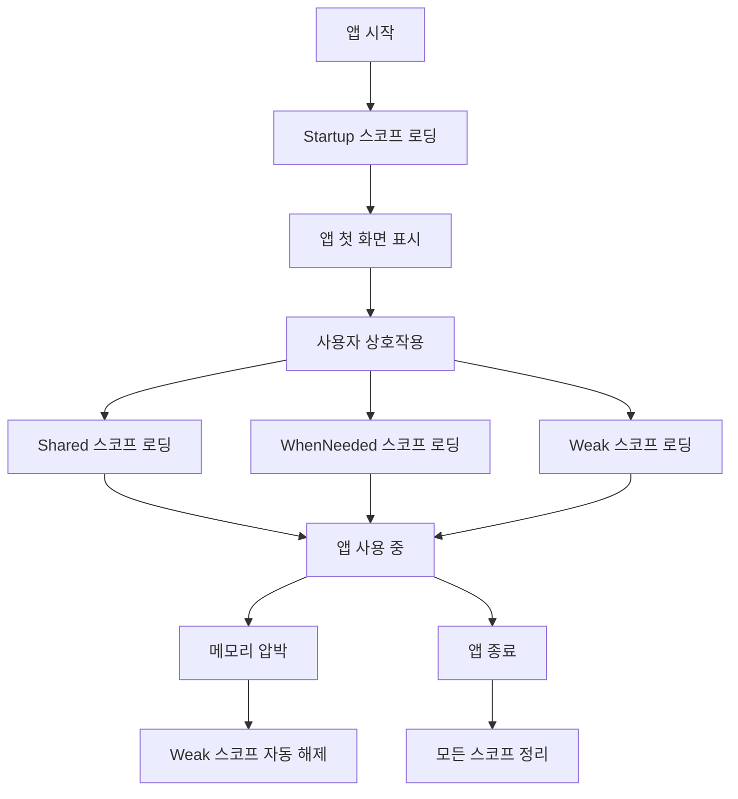

# Weaver DI 아키텍처 가이드

## 🎯 개요

Weaver는 Swift 6의 완전한 동시성 지원과 함께 설계된 현대적이고 직관적인 의존성 주입 라이브러리입니다. 복잡한 설정 없이 4가지 명확한 스코프로 모든 의존성을 관리할 수 있습니다.

## 🎛️ 직관적인 4가지 스코프

### 스코프 개요

| 스코프 | 설명 | 로딩 시점 | 사용 예시 |
|--------|------|-----------|-----------|
| **`.startup`** | 앱 시작 시 즉시 로딩되는 필수 서비스 | 앱 시작과 동시에 | 로깅, 크래시 리포팅, 기본 설정 |
| **`.shared`** | 앱 전체에서 하나의 인스턴스를 공유 | 첫 사용 시 | 데이터베이스, 네트워크 클라이언트 |
| **`.whenNeeded`** | 실제 사용할 때만 로딩되는 기능별 서비스 | 실제 사용 시 | 카메라, 결제, 위치 서비스 |
| **`.weak`** | 약한 참조로 관리되어 메모리 누수 방지 | 첫 사용 시 | 캐시, 델리게이트, 옵저버 |

### 스코프별 상세 설명

#### 🚀 `.startup` 스코프
```swift
// 앱 시작과 함께 즉시 로딩
await builder.register(LoggerKey.self, scope: .startup) { _ in
    ProductionLogger()
}

await builder.register(CrashReporterKey.self, scope: .startup) { _ in
    CrashlyticsReporter()
}
```

**특징:**
- 앱 시작과 동시에 자동 로딩
- 앱 전체에서 반드시 필요한 서비스
- 빠른 앱 시작을 위해 최소한으로 유지

**사용 예시:**
- 로깅 시스템
- 크래시 리포팅
- 기본 설정 관리
- 보안 초기화

#### 🔄 `.shared` 스코프
```swift
// 앱 전체에서 하나의 인스턴스 공유
await builder.register(DatabaseKey.self, scope: .shared) { _ in
    CoreDataManager()
}

await builder.register(NetworkClientKey.self, scope: .shared) { _ in
    URLSessionClient()
}
```

**특징:**
- 싱글톤 패턴 구현
- 첫 사용 시 생성되어 앱 종료까지 유지
- 메모리 효율적인 리소스 공유

**사용 예시:**
- 데이터베이스 매니저
- 네트워크 클라이언트
- 사용자 세션 관리
- 앱 설정 관리

#### 💤 `.whenNeeded` 스코프
```swift
// 실제 사용할 때만 로딩
await builder.register(CameraServiceKey.self, scope: .whenNeeded) { _ in
    CameraService()
}

await builder.register(PaymentServiceKey.self, scope: .whenNeeded) { resolver in
    let networkClient = try await resolver.resolve(NetworkClientKey.self)
    return PaymentService(networkClient: networkClient)
}
```

**특징:**
- 지연 로딩으로 앱 시작 성능 최적화
- 사용하지 않으면 메모리에 로딩되지 않음
- 기능별 모듈화에 최적

**사용 예시:**
- 카메라 서비스
- 결제 시스템
- 위치 서비스
- 소셜 공유 기능

#### 🧹 `.weak` 스코프
```swift
// 약한 참조로 메모리 효율 관리
await builder.registerWeak(ImageCacheKey.self) { _ in
    ImageCache()
}

await builder.registerWeak(NotificationCenterKey.self) { _ in
    CustomNotificationCenter()
}
```

**특징:**
- 약한 참조로 메모리 누수 방지
- 메모리 압박 시 자동 해제
- 클래스 타입만 지원 (컴파일 타임 검증)

**사용 예시:**
- 이미지 캐시
- 델리게이트 패턴
- 옵저버 패턴
- 임시 데이터 저장소

## 🏗️ 아키텍처 설계 원칙

### 1. 단순성 우선 (Simplicity First)
```swift
// ❌ 복잡한 이전 방식
await builder.register(LoggerKey.self, scope: .bootstrap, timing: .eager)

// ✅ 단순한 현재 방식
await builder.register(LoggerKey.self, scope: .startup)
```

### 2. 자동 최적화 (Auto-Optimization)
- 스코프에 따라 라이브러리가 최적의 로딩 시점 자동 결정
- 개발자는 스코프만 선택하면 됨
- 잘못된 조합 방지 (컴파일 타임 안전성)

### 3. 완전한 비동기 (Fully Async)
```swift
// ✅ 블로킹 없는 비동기 설계
public func waitForReady() async throws -> any Resolver

// ❌ 제거된 블로킹 방식
// public func waitForReady(timeout: TimeInterval?) async throws -> any Resolver
```

## 📱 실제 앱 구조 예시

### 전형적인 iOS 앱의 스코프 분류

```swift
@main
struct MyApp: App {
    init() {
        Task {
            try await Weaver.setup(modules: [
                // 🚀 Startup: 앱 시작 시 필수
                LoggingModule(),
                CrashReportingModule(),
                SecurityModule(),
                
                // 🔄 Shared: 앱 전체 공유
                DatabaseModule(),
                NetworkModule(),
                UserSessionModule(),
                
                // 💤 WhenNeeded: 기능별 로딩
                CameraModule(),
                PaymentModule(),
                LocationModule(),
                SocialSharingModule(),
                
                // 🧹 Weak: 메모리 효율
                CacheModule(),
                NotificationModule(),
            ])
        }
    }
    
    var body: some Scene {
        WindowGroup {
            ContentView()
        }
    }
}
```

### 모듈 구현 예시

```swift
// 🚀 Startup 모듈
struct LoggingModule: Module {
    func configure(_ builder: WeaverBuilder) async {
        await builder.register(LoggerKey.self, scope: .startup) { _ in
            ProductionLogger()
        }
    }
}

// 🔄 Shared 모듈
struct NetworkModule: Module {
    func configure(_ builder: WeaverBuilder) async {
        await builder.register(HTTPClientKey.self, scope: .shared) { _ in
            URLSessionHTTPClient()
        }
        
        await builder.register(APIServiceKey.self, scope: .shared) { resolver in
            let httpClient = try await resolver.resolve(HTTPClientKey.self)
            let logger = try await resolver.resolve(LoggerKey.self)
            return APIService(httpClient: httpClient, logger: logger)
        }
    }
}

// 💤 WhenNeeded 모듈
struct CameraModule: Module {
    func configure(_ builder: WeaverBuilder) async {
        await builder.register(CameraServiceKey.self, scope: .whenNeeded) { resolver in
            let logger = try await resolver.resolve(LoggerKey.self)
            return CameraService(logger: logger)
        }
    }
}

// 🧹 Weak 모듈
struct CacheModule: Module {
    func configure(_ builder: WeaverBuilder) async {
        await builder.registerWeak(ImageCacheKey.self) { _ in
            ImageCache(maxSize: 100)
        }
    }
}
```

## 🔄 생명주기 관리

### 스코프별 생명주기



### 자동 메모리 관리

```swift
// 메모리 압박 시 자동 정리
await container.performMemoryCleanup(forced: false)

// 수동 메모리 정리
await container.performMemoryCleanup(forced: true)
```

## 🧪 테스트 전략

### 스코프별 테스트

```swift
class NetworkModuleTests: XCTestCase {
    func testSharedScope() async throws {
        // Shared 스코프 테스트
        let container = await WeaverContainer.testBuilder()
            .register(HTTPClientKey.self, scope: .shared) { _ in
                MockHTTPClient()
            }
            .build()
        
        let client1 = try await container.resolve(HTTPClientKey.self)
        let client2 = try await container.resolve(HTTPClientKey.self)
        
        // 같은 인스턴스인지 확인
        XCTAssertTrue(client1 === client2)
    }
    
    func testWhenNeededScope() async throws {
        // WhenNeeded 스코프 테스트
        var factoryCallCount = 0
        
        let container = await WeaverContainer.testBuilder()
            .register(CameraServiceKey.self, scope: .whenNeeded) { _ in
                factoryCallCount += 1
                return MockCameraService()
            }
            .build()
        
        // 사용하지 않으면 생성되지 않음
        XCTAssertEqual(factoryCallCount, 0)
        
        // 첫 사용 시 생성
        _ = try await container.resolve(CameraServiceKey.self)
        XCTAssertEqual(factoryCallCount, 1)
    }
}
```

## 📊 성능 특성

### 앱 시작 성능

| 스코프 | 로딩 시점 | 시작 시간 영향 |
|--------|-----------|----------------|
| `.startup` | 앱 시작 시 | 직접 영향 |
| `.shared` | 첫 사용 시 | 영향 없음 |
| `.whenNeeded` | 실제 사용 시 | 영향 없음 |
| `.weak` | 첫 사용 시 | 영향 없음 |

### 메모리 사용량

```swift
// 메모리 효율적인 설계
// - Startup: 최소한의 필수 서비스만
// - Shared: 필요한 만큼만 로딩
// - WhenNeeded: 사용하지 않으면 메모리에 없음
// - Weak: 메모리 압박 시 자동 해제
```

## 🔍 디버깅 및 모니터링

### 로깅 시스템

```swift
// 스코프 활성화 로그
🚀 스코프 활성화 시작: startup
✅ 스코프 활성화 완료: startup
🚀 스코프 활성화 시작: shared
✅ 스코프 활성화 완료: shared
```

### 성능 모니터링

```swift
let monitor = WeaverPerformanceMonitor(enabled: true)
let report = await monitor.generatePerformanceReport()
print(report)

// 출력 예시:
// 📊 Weaver Performance Report
// ═══════════════════════════════
// 📈 Resolution Performance:
// - Total Resolutions: 1,234
// - Average Time: 0.045ms
// - Slow Resolutions: 2
```

## 🚀 마이그레이션 가이드

### 기존 코드에서 업그레이드

```swift
// ❌ 이전 복잡한 방식
await builder.register(LoggerKey.self, scope: .bootstrap, timing: .eager)
await builder.register(DatabaseKey.self, scope: .container, timing: .lazy)

// ✅ 새로운 단순한 방식
await builder.register(LoggerKey.self, scope: .startup)
await builder.register(DatabaseKey.self, scope: .shared)
```

### 스코프 매핑 가이드

| 이전 스코프 | 새로운 스코프 | 설명 |
|-------------|---------------|------|
| `.bootstrap` | `.startup` | 앱 시작 시 필수 |
| `.container` | `.shared` | 공유 인스턴스 |
| `.appService` | `.shared` | 앱 전체 서비스 |
| `.core` | `.shared` | 핵심 서비스 |
| `.feature` | `.whenNeeded` | 기능별 서비스 |
| `.cached` | `.shared` | 캐시된 서비스 |
| `.weak` | `.weak` | 약한 참조 (동일) |

이 새로운 아키텍처를 통해 더 직관적이고 성능이 뛰어난 의존성 주입 시스템을 구축할 수 있습니다.
## 🎨 Swif
tUI 통합 (개선됨)

### Preview 지원 강화

새로운 타입 안전한 Preview 등록 시스템:

```swift
#Preview {
    ContentView()
        .weaver(modules: PreviewWeaverContainer.previewModules(
            .register(NetworkServiceKey.self, mockValue: MockNetworkService(baseURL: "https://preview.api.com")),
            .register(DatabaseServiceKey.self) { _ in
                MockDatabaseService(connectionString: "preview://memory")
            },
            .register(LoggerServiceKey.self, mockValue: MockLoggerService(level: .debug))
        ))
}
```

### 편의 Mock 생성자

일반적인 서비스들을 위한 편의 메서드:

```swift
#Preview {
    ContentView()
        .weaver(modules: [
            PreviewWeaverContainer.mockNetworkService(baseURL: "https://preview.api.com"),
            PreviewWeaverContainer.mockDatabaseService(connectionString: "preview://memory"),
            PreviewWeaverContainer.mockLoggerService(level: .debug)
        ])
}
```

## ⚡ 확장 가능한 우선순위 시스템 (신규)

### 기본 우선순위 시스템

Weaver는 이제 3단계 우선순위 시스템을 제공합니다:

1. **스코프 기반 기본 우선순위** (100단위)
2. **서비스명 기반 세밀한 조정** (10단위)  
3. **의존성 기반 추가 조정** (1단위)

```swift
// 자동으로 계산되는 우선순위 예시:
// LoggerService: 0 (startup) + 0 (logger) + 0 (의존성 없음) = 0
// NetworkService: 0 (startup) + 30 (network) + 1 (logger 의존) = 31
// DatabaseService: 0 (startup) + 40 (database) + 2 (logger, network 의존) = 42
```

### 커스텀 우선순위 제공자

복잡한 앱에서 특별한 초기화 순서가 필요한 경우:

```swift
let customProvider = CustomServicePriorityProvider(
    customPriorities: [
        "SpecialServiceKey": 5,  // 로거 다음에 초기화
        "CriticalServiceKey": 1  // 매우 높은 우선순위
    ]
)

// 컨테이너 빌드 시 사용
let container = await WeaverContainer.builder()
    .withPriorityProvider(customProvider)
    .register(...)
    .build()
```

### 자체 우선순위 제공자 구현

```swift
struct MyCustomPriorityProvider: ServicePriorityProvider {
    func getPriority(for key: AnyDependencyKey, registration: DependencyRegistration) async -> Int {
        // 비즈니스 로직에 따른 커스텀 우선순위 계산
        if key.description.contains("Critical") {
            return 0  // 최우선
        }
        
        // 기본 로직으로 fallback
        return await DefaultServicePriorityProvider().getPriority(for: key, registration: registration)
    }
}
```

## 📊 성능 최적화 가이드

### 메모리 관리

```swift
// 메모리 압박 시 자동 정리
await container.performMemoryCleanup(forced: false)

// 강제 정리 (테스트나 특별한 상황에서)
await container.performMemoryCleanup(forced: true)
```

### 성능 모니터링

```swift
let metrics = await container.getMetrics()
print("캐시 히트율: \(metrics.cacheHitRate * 100)%")
print("평균 해결 시간: \(metrics.averageResolutionTime * 1000)ms")
print("성공률: \(metrics.successRate * 100)%")
```

## 🧪 테스트 지원 강화

### 테스트 헬퍼 활용

```swift
// 성능 측정
let (result, duration) = try await TestHelpers.measureTime {
    try await container.resolve(ServiceKey.self)
}
TestHelpers.assertPerformance(duration: duration, maxExpected: 0.001)

// 서비스 검증
WeaverAssertions.assertServiceInjected(service, isDefault: false)
WeaverAssertions.assertSameInstance(service1, service2) // shared 스코프용
```

### 복잡한 테스트 시나리오

```swift
// 전체 앱 시뮬레이션
let modules = TestDataFactory.createComplexModule()
let container = await WeaverContainer.builder()
    .withModules(modules)
    .build()

// 생명주기 테스트
await container.handleAppDidEnterBackground()
await container.handleAppWillEnterForeground()
await container.shutdown()
```

## 🔧 마이그레이션 가이드

### 기존 코드에서 업그레이드

1. **SwiftUI Preview 코드 업데이트:**
```swift
// 이전 방식
.weaver(modules: [PreviewModule()])

// 새로운 방식 (타입 안전)
.weaver(modules: PreviewWeaverContainer.previewModules(
    .register(ServiceKey.self, mockValue: mockService)
))
```

2. **커스텀 우선순위가 필요한 경우:**
```swift
// 기본 우선순위로 충분한 경우 - 변경 불필요
let container = await WeaverContainer.builder()
    .register(...)
    .build()

// 커스텀 우선순위가 필요한 경우만 추가
let container = await WeaverContainer.builder()
    .withPriorityProvider(customProvider)
    .register(...)
    .build()
```

## 📈 모범 사례

### 1. 스코프 선택 가이드

- **`.startup`**: 앱 시작 시 반드시 필요한 서비스 (최소한으로 유지)
- **`.shared`**: 앱 전체에서 공유되는 상태를 가진 서비스
- **`.whenNeeded`**: 특정 기능에서만 사용되는 서비스
- **`.weak`**: 순환 참조 위험이 있는 서비스

### 2. 성능 최적화

- startup 스코프는 앱 시작 속도에 직접 영향을 미치므로 최소화
- 무거운 초기화 작업은 whenNeeded 스코프 사용
- 메모리 사용량이 큰 서비스는 weak 스코프 고려

### 3. 테스트 전략

- 단위 테스트: 개별 서비스 로직 검증
- 통합 테스트: 의존성 체인 검증  
- 성능 테스트: 해결 시간 및 메모리 사용량 검증

이러한 개선사항들로 Weaver는 더욱 강력하고 유연한 의존성 주입 라이브러리가 되었습니다.