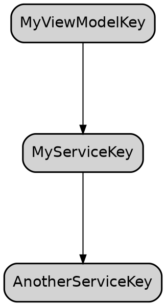

# 🕸️ Weaver

**Swift의 현대적인 동시성 모델(Actor, async/await)을 기반으로 설계된 차세대 의존성 주입(DI) 프레임워크**

Weaver는 타입 안전성, 동시성 안전성, 그리고 사용 편의성을 극대화하여 복잡한 애플리케이션의 의존성 관리를 단순화합니다. 모든 핵심 컴포넌트가 Actor로 구현되어 있어 데이터 경쟁(Data Race) 없이 안전하게 의존성을 관리하고, SwiftUI와의 완벽한 통합을 제공하여 개발자가 비즈니스 로직에만 집중할 수 있도록 돕습니다.

## ✨ 주요 특징

- **🛡️ 동시성 안전 설계**: 모든 핵심 컴포넌트가 Actor로 구현되어 있어 데이터 경쟁(Data Race) 없이 안전하게 의존성을 관리하고 해결합니다.
- **⚡️ 비동기 중심**: 의존성 생성 및 해결 과정이 `async/await`를 기반으로 설계되어 비동기 작업에 완벽하게 대응합니다.
- **🧩 유연한 스코프 관리**: `.container`, `.cached`, `.weak`, `.eagerContainer` 등 다양한 생명주기 스코프를 지원합니다.
- **🎨 SwiftUI 완벽 지원**: `.weaver()` ViewModifier 또는 `WeaverHost`를 통해 SwiftUI 뷰 계층에 손쉽게 DI 컨테이너를 통합할 수 있습니다.
- **🧪 간편한 테스팅**: `override` 기능을 통해 테스트 환경에서 특정 의존성을 손쉽게 가짜(Mock) 객체로 교체할 수 있습니다.
- **📊 고급 기능**: 의존성 그래프 시각화, 고급 캐싱 정책(LRU, FIFO), 성능 메트릭 수집 등 강력한 부가 기능을 제공합니다.

---

## 🏁 시작하기

Weaver는 의존성을 식별하는 `DependencyKey`와 등록 로직을 캡슐화하는 `Module`을 통해 의존성을 관리합니다.

### 1. 의존성 정의

먼저 주입할 서비스의 프로토콜과 구현체를 정의합니다.

```swift
protocol MyService: Sendable {
    func doSomething() -> String
}

final class MyServiceImpl: MyService {
    // 다른 서비스에 대한 의존성이 있다면 이곳에서 주입받을 수 있습니다.
    // init(anotherService: AnotherService) { ... }
    func doSomething() -> String { "Hello, Weaver! 🚀" }
}
```

### 2. 의존성 키(Key) 및 모듈(Module) 정의

`DependencyKey`를 정의하여 의존성을 고유하게 식별하고, `Module` 프로토콜을 채택한 구조체에서 등록 로직을 구현합니다.

```swift
// AppModules.swift
import Weaver

// 1. 의존성을 식별하기 위한 키를 정의합니다.
struct MyServiceKey: DependencyKey {
    // 의존성 해결에 실패했을 때 (주로 SwiftUI Preview에서) 사용할 기본값입니다.
    static var defaultValue: MyService = MyServiceImpl()
}

// 2. 관련 의존성들을 그룹화하는 모듈을 정의합니다.
struct AppModules: Module {
    // 3. configure 메서드에서 의존성을 빌더에 등록합니다.
    func configure(_ builder: WeaverBuilder) async {
        builder.register(MyServiceKey.self, scope: .container) { resolver in
            // 다른 의존성이 필요하다면 `resolver`를 통해 해결할 수 있습니다.
            // let anotherService = try await resolver.resolve(AnotherServiceKey.self)
            return MyServiceImpl()
        }
        
        // 다른 의존성들도 여기에 등록합니다.
    }
}
```

### 3. 앱 진입점에서 컨테이너 설정

앱의 최상위 뷰에서 `.weaver()` 수정자를 사용하여 컨테이너를 설정하고 정의한 모듈을 등록합니다.

```swift
// MyApp.swift
import SwiftUI

@main
struct MyApp: App {
    var body: some Scene {
        WindowGroup {
            ContentView()
                // .weaver는 내부적으로 비동기 빌드, 로딩 뷰 표시,
                // 환경 값 주입을 모두 처리해주는 편리한 API입니다.
                .weaver(modules: [AppModules()])
        }
    }
}
```

### 4. 의존성 주입 및 사용 (Injection & Usage)

`@Inject` 프로퍼티 래퍼를 사용하여 뷰나 다른 서비스에서 의존성을 주입받습니다.

```swift
// ContentView.swift
import SwiftUI
import Weaver

struct ContentView: View {
    // 2단계에서 정의한 `MyServiceKey`를 사용하여 의존성을 주입합니다.
    @Inject(MyServiceKey.self) private var myService

    @State private var message: String = "Loading..."

    var body: some View {
        Text(message)
            .task {
                // 의존성이 반드시 필요한 경우, 에러를 던지는(throwing) `resolved`를 사용합니다.
                do {
                    let resolvedService = try await $myService.resolved
                    self.message = resolvedService.doSomething()
                } catch {
                    self.message = "Error: \(error.localizedDescription)"
                }

                // 또는, 실패 시 `defaultValue`를 반환하는 non-throwing 호출을 사용할 수 있습니다.
                // let service = await myService()
                // self.message = service.doSomething()
            }
    }
}
```

---

## 📖 핵심 개념 (Core Concepts)

### 의존성 스코프 (Scopes)

`builder.register()` 메서드에서 `scope` 파라미터를 통해 의존성의 생명주기를 지정할 수 있습니다.

- `.container` (기본값): 컨테이너의 생명주기 동안 단일 인스턴스를 유지합니다. (Singleton)
- `.eagerContainer`: `.container`와 동일하지만, 컨테이너가 빌드될 때 즉시 인스턴스를 생성합니다. 앱 시작 시 바로 필요한 서비스에 유용합니다.
- `.cached`: 고급 캐시 정책(TTL, LRU/FIFO)에 따라 인스턴스를 관리합니다. 생성 비용이 비싸지만 재사용 가능한 객체에 적합합니다.
- `.weak`: 인스턴스를 약한 참조(weak reference)로 관리하여 메모리 누수를 방지합니다. 주로 Delegate 패턴이나 부모-자식 관계에서 순환 참조를 끊을 때 사용됩니다.

#### `.eagerContainer` 활용 시점
앱이 사용자에게 보여지기 전에 반드시 준비되어야 하는 핵심 서비스들은 `.eagerContainer` 스코프로 등록하는 것이 좋습니다. 예를 들어, 로깅 시스템, 분석 트래커, 기본 설정 로더 등이 해당됩니다.

`WeaverHost`나 `.weaver()` 수정자는 컨테이너가 완전히 준비될 때까지(`eager` 의존성 포함) 로딩 뷰를 표시하므로, 사용자는 초기화가 완료된 안정적인 상태에서 앱을 시작할 수 있습니다.

```swift
builder.register(AnalyticsTrackerKey.self, scope: .eagerContainer) { _ in
    // 이 서비스는 컨테이너 빌드 시 즉시 생성됩니다.
    FirebaseAnalyticsTracker()
}
```

### 플랫폼별 통합 (Platform Integration)

#### SwiftUI

SwiftUI 앱에서는 `WeaverHost` 또는 `.weaver()` ViewModifier를 사용하는 것이 가장 이상적입니다. 이 API들은 내부적으로 다음 과정을 자동으로 처리합니다.

1.  `WeaverKernel`을 생성하고 뷰의 생명주기에 맞게 관리합니다.
2.  백그라운드 `Task`를 통해 컨테이너 빌드를 비동기적으로 시작합니다.
3.  빌드가 진행되는 동안(특히 `.eagerContainer` 의존성 초기화 중) 지정된 로딩 뷰를 표시합니다.
4.  빌드가 완료되면, 생성된 `Resolver`를 SwiftUI의 `Environment`에 주입합니다.
5.  모든 하위 뷰는 `@Inject`를 통해 안전하게 의존성을 사용할 수 있습니다.

```swift
// 앱의 최상위에서 WeaverHost 사용하기
@main
struct MyApp: App {
    var body: some Scene {
        WindowGroup {
            WeaverHost(modules: [AppModules()]) { resolver in
                // 빌드가 완료되면 이 클로저가 실제 resolver와 함께 호출됩니다.
                ContentView()
            }
        }
    }
}
```

#### UIKit / AppKit / Server-side

SwiftUI를 사용하지 않는 환경에서는 `DefaultWeaverKernel`을 직접 생성하고 생명주기를 관리해야 합니다.

```swift
import Weaver

@main
class AppDelegate: UIResponder, UIApplicationDelegate {

    var window: UIWindow?
    // 1. 앱의 생명주기와 함께할 커널을 생성합니다.
    let kernel = DefaultWeaverKernel(modules: [AppModules()])

    func application(_ application: UIApplication, didFinishLaunchingWithOptions launchOptions: [UIApplication.LaunchOptionsKey: Any]?) -> Bool {
        
        Task {
            // 2. 컨테이너 빌드를 비동기적으로 시작합니다.
            await kernel.build()

            // 3. 상태 스트림을 구독하여 빌드 완료(.ready)를 감지합니다.
            for await state in kernel.stateStream {
                if case .ready(let container) = state {
                    // 4. 빌드가 완료되면, 해당 컨테이너 스코프 내에서 UI를 설정합니다.
                    await Weaver.withScope(container) {
                        // 이 블록 안에서 생성되는 객체들은 @Inject를 사용할 수 있습니다.
                        let mainVC = MainViewController()
                        // ... 윈도우 설정 ...
                    }
                    break // .ready 상태를 한 번만 처리하기 위해 구독을 중단합니다.
                }
            }
        }
        return true
    }
    
    // 5. 앱 종료 시 커널을 안전하게 종료하여 리소스를 정리합니다.
    func applicationWillTerminate(_ application: UIApplication) {
        Task {
            await kernel.shutdown()
        }
    }
}
```

---

## 🔬 고급 기능

### `.weak` 와 `.cached` 스코프 비교

`.weak`와 `.cached`는 모두 인스턴스가 영구적이지 않다는 공통점이 있지만, 목적과 동작 방식이 완전히 다릅니다.

| 구분 | `.weak` 스코프 | `.cached` 스코프 |
| :--- | :--- | :--- |
| **주요 목표** | 순환 참조 방지 (메모리 누수 방지) | 생성 비용이 비싼 객체의 재사용 (성능 최적화) |
| **참조 타입** | `weak` (약한 참조) | `strong` (강한 참조) |
| **제거 트리거** | 외부의 모든 강한 참조가 사라졌을 때 (ARC에 의해 자동 해제) | 캐시 정책(TTL, 최대 크기, 메모리 압박)에 따라 능동적으로 제거 |
| **주요 사용 사례** | Delegate 패턴, 부모-자식 관계 (e.g., Coordinator-ViewModel) | 데이터 파서, 정규식 객체, 네트워크 클라이언트 등 |

#### `.weak` 스코프 사용 예시: Coordinator와 ViewModel

`ViewModel`이 자신을 생성한 `Coordinator`에게 이벤트를 알려야 할 때 순환 참조가 발생할 수 있습니다. `.weak` 스코프는 이 문제를 해결합니다. `registerWeak` 메서드는 컴파일 타임에 값 타입(struct, enum)이 등록되는 것을 막아 런타임 오류를 방지합니다.

```swift
protocol MyCoordinatorProtocol: AnyObject, Sendable { /* ... */ }
final class MyCoordinator: MyCoordinatorProtocol { /* ... */ }

final class MyViewModel {
    // ViewModel은 Coordinator를 소유하지 않고, 약한 참조로 주입받습니다.
    @Inject(MyCoordinatorKey.self) private var coordinator
    
    func closeButtonTapped() async {
        // 약한 참조이므로, 사용 시점에는 nil일 수 있습니다.
        // non-throwing 호출을 사용하여 안전하게 접근합니다.
        await coordinator()?.goBack()
    }
}

// Coordinator가 ViewModel을 생성할 때...
func showMyView() async {
    // 1. ViewModel만을 위한 자식 컨테이너를 생성합니다.
    let childContainer = await parentContainer.reconfigure(with: [
        // 2. 이 모듈에서 자기 자신(Coordinator)을 .weak 스코프로 등록합니다.
        AnonymousModule { builder in
            // registerWeak는 컴파일 타임에 참조 타입(class)만 받도록 강제합니다.
            await builder.registerWeak(MyCoordinatorKey.self) { _ in self }
        }
    ])
    
    // 3. 자식 컨테이너 스코프에서 ViewModel을 생성합니다.
    await Weaver.withScope(childContainer) {
        let viewModel = MyViewModel() // 이 ViewModel은 Coordinator에 대한 약한 참조를 갖게 됩니다.
        // ... 뷰에 viewModel 전달 ...
    }
}
```

#### `.cached` 스코프 사용 예시: 생성 비용이 비싼 Markdown 파서

`MarkdownParser`는 초기화 비용이 비싸지만, 자주 사용될 수 있습니다. `.cached` 스코프를 사용하면 일정 시간 동안 인스턴스를 재사용하여 성능을 향상시킬 수 있습니다.

```swift
struct MarkdownParserKey: DependencyKey { static var defaultValue: MarkdownParser = .init() }

// 모듈 설정
func configure(_ builder: WeaverBuilder) async {
    builder.register(MarkdownParserKey.self, scope: .cached) { _ in
        MarkdownParser() // 초기화 비용이 비싼 객체
    }
}

// 컨테이너 빌드 시 캐시 정책 설정
let builder = WeaverContainer.builder()
    .enableAdvancedCaching(policy: .init(maxSize: 10, ttl: 300)) // 10개, 5분 TTL

// 사용처
struct ArticleView: View {
    @Inject(MarkdownParserKey.self) private var parser
    
    func renderContent(_ markdown: String) async -> AttributedString {
        // 짧은 시간 내에 여러 번 호출되어도 동일한 parser 인스턴스를 재사용합니다.
        // 5분이 지나면 새로운 인스턴스가 생성됩니다.
        return try await $parser.resolved.parse(markdown)
    }
}
```

### 의존성 그래프 시각화

복잡한 의존성 관계를 한눈에 파악할 수 있도록 그래프를 생성할 수 있습니다.

```swift
let container: WeaverContainer = // ... 컨테이너 인스턴스

// DOT 형식의 그래프 문자열 생성
let dotGraph = container.getDependencyGraph().generateDotGraph()
print(dotGraph)
```

생성된 DOT 문자열을 Graphviz와 같은 도구에 붙여넣으면 의존성 그래프를 시각적으로 확인할 수 있습니다.



### 고급 캐싱

`.cached` 스코프를 위해 캐시 정책(최대 크기, 생존 시간, 퇴출 정책)을 설정할 수 있습니다.

```swift
let builder = WeaverContainer.builder()

// 캐시 정책 정의
let policy = CachePolicy(
    maxSize: 50, // 최대 50개 아이템 캐시
    ttl: 60,     // 60초 후 만료
    evictionPolicy: .lru // 가장 최근에 사용되지 않은 항목부터 제거
)

// 빌더에 캐싱 기능 활성화
builder.enableAdvancedCaching(policy: policy)

// .cached 스코프로 의존성 등록
builder.register(MyCachedServiceKey.self, scope: .cached) { ... }
```

### 성능 메트릭

의존성 해결 성능을 분석하기 위한 메트릭 수집 기능을 활성화할 수 있습니다.

```swift
let builder = WeaverContainer.builder()
builder.enableMetricsCollection()

// ... 빌드 후 ...

let container: WeaverContainer = await builder.build()

// 메트릭 조회
let metrics = await container.getMetrics()
print(metrics)
/*
Resolution Metrics:
- Total Resolutions: 105
- Success Rate: 100.0%
- Failed Resolutions: 0
- Cache Hit Rate: 80.0% (Hits: 80, Misses: 20)
- Avg. Resolution Time: 0.0015ms
- Weak References: 5/5 alive (100.0%)
*/
```

---

## 🧪 테스팅

테스트 환경에서는 `override`를 사용하여 실제 의존성을 Mock 객체로 쉽게 교체할 수 있습니다.

```swift
class MyServiceMock: MyService {
    func doSomething() -> String { "Hello from Mock! 🧪" }
}

func testViewModelWithMockService() async throws {
    // 1. 테스트용 빌더 생성
    let builder = WeaverContainer.builder()
    
    // 2. AppModules를 등록하되, myService를 Mock으로 교체
    await AppModules().configure(builder)
    builder.override(MyServiceKey.self) { _ in
        MyServiceMock()
    }

    // 3. 테스트 컨테이너 빌드
    let container = await builder.build()

    // 4. 테스트 실행
    await Weaver.withScope(container) {
        let viewModel = MyViewModel() // MyViewModel은 내부적으로 MyService를 주입받음
        let result = await viewModel.fetchData()
        
        // Mock 객체가 반환한 값인지 확인
        XCTAssertEqual(result, "Hello from Mock! 🧪")
    }
}
```

## 📦 설치

Swift Package Manager를 사용하여 Weaver를 프로젝트에 추가할 수 있습니다.

```swift
// Package.swift

dependencies: [
    .package(url: "https://github.com/YOUR_USERNAME/Weaver.git", from: "1.0.0")
],
targets: [
    .target(
        name: "MyApp",
        dependencies: ["Weaver"]
    )
]
```

## 📄 라이선스

Weaver는 MIT 라이선스에 따라 배포됩니다.

```