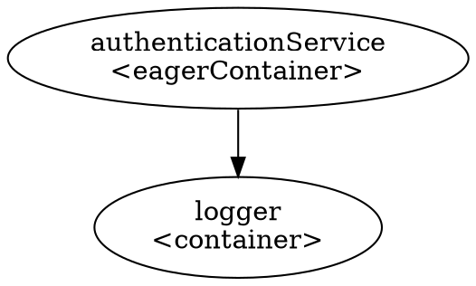

# Weaver 🕸️

[](https://swift.org)
[](https://developer.apple.com/swift/)
[](https://opensource.org/licenses/MIT)

**Weaver**는 Swift 6의 현대적인 동시성 모델(`async/await`, `actor`)을 기반으로 설계된, **타입-세이프(Type-Safe)하고 강력한 의존성 주입(Dependency Injection) 라이브러리**입니다. 데이터 경쟁(Data Race)으로부터 원천적으로 안전하며, 비동기 환경, 특히 **SwiftUI**에 완벽하게 통합됩니다.

## ✨ 주요 특징

  - **동시성 안전 설계 (Concurrency Safety)**: 핵심 컴포넌트인 `WeaverContainer`가 `actor`로 구현되어, 복잡한 락(lock) 없이도 스레드로부터 안전한 의존성 관리 및 해결을 보장합니다.
  - **선언적 API (Declarative API)**: `@Registrar` 및 `@Register` 매크로를 통해 보일러플레이트 없이 간결하고 직관적으로 의존성을 선언할 수 있습니다.
  - **강력한 생명주기 관리 (Powerful Lifecycle Scopes)**:
      - `.container`: 최초 요청 시 한 번만 생성되는 **Lazy Singleton** 스코프.
      - `.cached`: TTL, 개수 제한, LRU/FIFO 퇴출 정책을 지원하는 **고급 캐시** 스코프.
      - `.eagerContainer`: 앱 시작 시점에 즉시 생성되는 **Eager Singleton** 스코프로, 비동기 초기화 문제를 우아하게 해결합니다.
  - **완벽한 SwiftUI 통합 (Seamless SwiftUI Integration)**:
      - `WeaverHost` 및 `.weaver()` 수정자를 통해 SwiftUI 뷰 계층에 안전하게 의존성을 주입합니다.
      - `@Environment(\.weaverResolver)`를 통해 뷰에서 의존성을 쉽게 해결할 수 있습니다.
      - 플레이스홀더(Placeholder) 컨테이너를 통해 **SwiftUI Preview가 항상 정상적으로 동작**하도록 보장합니다.
  - **의존성 그래프 시각화**: 등록된 의존성 간의 관계를 시각적으로 파악할 수 있는 **그래프 생성 기능**을 제공하여 디버깅 및 아키텍처 분석을 돕습니다.

-----

## 🚀 시작하기: SwiftUI와 함께

`Weaver`는 SwiftUI 앱에 의존성을 주입하는 현대적이고 간결한 방법을 제공합니다. 이 가이드에서는 \*\*"초기화에 5초가 걸리는 무거운 인증 서비스"\*\*를 앱 시작 시점에 안전하게 준비시키는 과정을 통해 `Weaver`의 핵심 기능을 살펴보겠습니다.

### 1\. 서비스 정의 및 DependencyKey

먼저, 앱에서 사용할 서비스와 각 서비스를 고유하게 식별할 `DependencyKey`를 정의합니다.

```swift
import Foundation
import Weaver

// --- 서비스 프로토콜 ---

protocol LoggerService: Sendable {
    func log(_ message: String)
}

protocol AuthenticationService: Sendable {
    var userID: String { get }
    func login()
}

// --- 서비스 구현체 ---

class ProductionLogger: LoggerService, @unchecked Sendable {
    func log(_ message: String) { print("🪵 [Logger]: \(message)") }
}

// ⚠️ 초기화에 5초가 걸리는 무거운 서비스
class FirebaseAuthService: AuthenticationService, @unchecked Sendable {
    let userID: String

    init(logger: LoggerService) {
        logger.log("🔥 인증 서비스 초기화 시작... (5초 소요)")
        Thread.sleep(forTimeInterval: 5) // 실제 앱에서는 비동기 네트워크 요청
        self.userID = "user_12345"
        logger.log("✅ 인증 서비스 초기화 완료!")
    }

    func login() {
        print("🎉 [Auth]: \(userID)님, 성공적으로 로그인되었습니다!")
    }
}

// --- DependencyKey 정의 ---

struct LoggerServiceKey: DependencyKey {
    static var defaultValue: any LoggerService { ProductionLogger() }
}

struct AuthenticationServiceKey: DependencyKey {
    // 미리 준비되어야 하므로, 기본값은 fatalError로 설정
    static var defaultValue: any AuthenticationService {
        fatalError("AuthenticationService는 반드시 Eager-Loading 되어야 합니다.")
    }
}
```

### 2\. Weaver 모듈 정의와 생명주기 선택

`@Registrar` 매크로를 사용하여 의존성들을 그룹화하고, 각 서비스의 특성에 맞는 **스코프**를 지정합니다.

  - **`@Register(scope: .container)`**: `LoggerService`처럼 가볍고, 필요할 때 만들어도 되는 서비스에 사용합니다.
  - **`@Register(scope: .eagerContainer)`**: `AuthenticationService`처럼 무겁고 앱 시작에 필수적인 서비스에 사용합니다. 이것이 바로 `Weaver`의 비동기 초기화 문제 해결의 핵심입니다.

<!-- end list -->

```swift
import Weaver

@Registrar
struct ServiceModule: Module {
    // ✅ Logger는 가벼우므로, 필요할 때 생성 (.container)
    @Register(scope: .container)
    var logger: any LoggerService {
        ProductionLogger()
    }

    // ✅ 인증 서비스는 무겁고 필수적이므로, 즉시 생성 (.eagerContainer)
    @Register(scope: .eagerContainer)
    func authenticationService(resolver: Resolver) async throws -> any AuthenticationService {
        // 다른 서비스(logger)에 의존할 수 있습니다.
        let logger = try await resolver.resolve(LoggerServiceKey.self)
        return FirebaseAuthService(logger: logger)
    }
}
```

### 3\. SwiftUI 뷰와 컨테이너 설정

`WeaverHost`를 사용하여 앱의 최상위 뷰를 감싸고, 컨테이너 빌드가 완료될 때까지 보여줄 로딩 뷰를 설정합니다.

```swift
import SwiftUI
import Weaver

@main
struct MyApp: App {
    var body: some Scene {
        WindowGroup {
            WeaverHost(
                modules: [ServiceModule()],
                loadingView: {
                    VStack {
                        ProgressView()
                        Text("앱의 핵심 서비스를 준비 중입니다...")
                    }
                }
            ) { resolver in // 빌드가 완료되면 실제 resolver가 전달됩니다.
                ContentView()
                    .environment(\.weaverResolver, resolver)
            }
        }
    }
}
```

### 4\. 뷰에서 의존성 사용하기

이제 뷰에서는 `@Environment(\.weaverResolver)`를 통해 주입된 `resolver`를 사용하여, 필요할 때 언제든지 의존성 객체를 안전하게 가져올 수 있습니다.

```swift
struct ContentView: View {
    @Environment(\.weaverResolver) private var resolver

    var body: some View {
        VStack(spacing: 20) {
            Text("Weaver 준비 완료!")
                .font(.largeTitle.bold())

            Button("로그인 실행") {
                Task {
                    // 이 시점에는 5초가 걸리는 인증 서비스가 이미 준비되어 있습니다.
                    let auth = try await resolver.resolve(AuthenticationServiceKey.self)
                    auth.login()
                }
            }
        }
    }
}
```

### 실행 결과 🎬

1.  **앱 시작 (0초)**: 화면에 "앱의 핵심 서비스를 준비 중입니다..."라는 로딩 뷰가 나타납니다.
2.  **백그라운드 준비 (0초 \~ 5초)**: `Weaver`가 `.eagerContainer`로 등록된 `authenticationService`를 백그라운드에서 생성합니다.
3.  **준비 완료 (5초 시점)**: 서비스 생성이 완료되면 로딩 뷰는 사라지고 `ContentView`가 나타납니다.
4.  **사용자 인터랙션 (5초 이후)**: `로그인 실행` 버튼을 누르면, **아무런 딜레이 없이** 즉시 인증 서비스가 실행됩니다.

이것이 바로 `Weaver`가 비동기 초기화 문제를 해결하는 우아한 방식입니다. **비싼 초기화 비용을 앱 시작 시 로딩 화면 뒤에서 모두 처리**하여, 사용자에게는 항상 완벽하게 준비된 상태의 앱을 제공합니다.

-----

## 🔬 고급 기능

### 생명주기 스코프 (Lifecycle Scopes)

`Weaver`는 세 가지의 강력한 스코프를 제공하여 의존성의 생명주기를 정교하게 관리할 수 있습니다.

| 스코프 | 생성 시점 (Initialization) | 사용 사례 |
| :--- | :--- | :--- |
| **`.container`** | **Lazy**: 최초 `resolve()` 호출 시 | 일반적인 서비스, 가벼운 객체, 특정 화면에서만 사용되는 경우 |
| **`.eagerContainer`** | **Eager**: `WeaverContainer` 빌드 시 | **핵심 서비스**, 비싼 초기화 비용, 앱 시작 시 반드시 준비되어야 하는 경우 |
| **`.cached`** | **Lazy**: 최초 `resolve()` 호출 시 | TTL, 개수 제한 등 **고급 캐시 정책**이 필요한 경우 |

### 의존성 그래프 디버깅

복잡한 의존성 관계를 한눈에 파악하고 싶을 때, `getDependencyGraph()`를 사용할 수 있습니다.

```swift
let container = await WeaverContainer.builder()
    .withModules([ServiceModule()])
    .build()

// DOT 언어 형식의 그래프 문자열 생성
let dotGraph = await container.getDependencyGraph().generateDotGraph()
print(dotGraph)
```

생성된 문자열을 [Graphviz Online](https://dreampuf.github.io/GraphvizOnline/)과 같은 도구에 붙여넣으면, 아래와 같이 의존성 관계가 시각화된 다이어그램을 얻을 수 있습니다.



이를 통해 어떤 서비스가 다른 서비스에 의존하는지, 각 서비스의 스코프는 무엇인지 명확하게 파악하여 아키텍처를 개선하고 문제를 디버깅하는 데 큰 도움을 받을 수 있습니다.

## 📜 라이선스

Weaver는 MIT 라이선스에 따라 제공됩니다.
