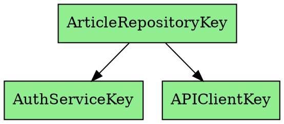

# Weaver 🕸️

**A Modern, Type-Safe, and Concurrency-Focused Dependency Injection Container for Swift.**

[](https://www.swift.org)
[](https://www.swift.org)
[](https://swift.org/package-manager/)
[](https://opensource.org/licenses/MIT)

Weaver is a next-generation Dependency Injection container for Swift, meticulously crafted for the modern era of concurrent programming. Built from the ground up with Swift 6's strict concurrency model in mind, its `actor`-based core guarantees thread safety out of the box. Weaver isn't just about managing dependencies; it's about building robust, scalable, and maintainable applications with confidence and clarity.

---

## Features

- **Concurrency-First Architecture**: Built entirely with `actor`s, Weaver is inherently data-race safe and seamlessly integrates with the Swift Concurrency model. All APIs are fully `Sendable`.
- **Modular by Design**: Organize dependencies into logical `Module`s that mirror your app's features, preventing the "massive dependency file" problem and improving maintainability.
- **Type-Safe Resolution**: Leverage the Swift compiler to catch dependency errors at build time, not runtime. Say goodbye to unexpected `nil` values and type-casting errors.
- **Elegant `@Inject` Wrapper**: Declare dependencies effortlessly with a clean and intuitive property wrapper. Your business logic remains pure and focused, free from boilerplate DI code.
- **Powerful Scoping**: Fine-grained control over object lifecycles with `.container` (singleton), `.cached` (time- or policy-based), and `.transient` (new instance every time) scopes.
- **Hierarchical Containers**: Override dependencies with ease for testing, feature flagging, or different environments. Create child containers that inherit from and extend parent configurations.
- **Insightful Tooling**: Analyze container performance with built-in metrics and visualize your architecture with auto-generated dependency graphs.

---

## Installation

### Swift Package Manager

Add `Weaver` to your project by including it in your `Package.swift` file's `dependencies` array.

```swift
.package(url: "https://github.com/AxiomOrient/Weaver.git", from: "0.0.2")
```

Then, add `"Weaver"` to your target's `dependencies`.

```swift
.target(
    name: "MyApp",
    dependencies: ["Weaver"]
)
```

---

## Quick Start

Getting started with Weaver involves three simple steps:

### 1. Define a Service and its Key

A `DependencyKey` is a unique, typed identifier for your service. It defines the contract (protocol) and provides a default implementation.

```swift
// --- Services/NetworkService.swift

// Define the contract for your service
protocol NetworkServicing: Sendable {
    func fetchData() async -> String
}

// Provide a default implementation
final class DefaultNetworkService: NetworkServicing {
    func fetchData() async -> String { "Hello from the network!" }
}

// Create a unique key to identify this service
struct NetworkServiceKey: DependencyKey {
    static var defaultValue: NetworkServicing = DefaultNetworkService()
}
```

### 2. Build the Container

The `WeaverContainer` holds your dependency registrations. Use the fluent builder API to register your services.

```swift
// --- App.swift

let container = await WeaverContainer.builder()
    .register(NetworkServiceKey.self, scope: .container) { _ in DefaultNetworkService() }
    .build()
```

### 3. Set the Scope and Resolve

Use `Weaver.withScope(_:operation:)` to make the container available to the current asynchronous task. Inside the scope, you can resolve your dependencies.

```swift
do {
    // Make the container available for the current task
    try await Weaver.withScope(container) {
        // Resolve the service using its key
        let networkService = try await container.resolve(NetworkServiceKey.self)
        
        let message = await networkService.fetchData()
        print(message) // Prints: "Hello from the network!"
    }
} catch {
    print("Error resolving dependency: \(error.localizedDescription)")
}
```

---

## Advanced Example: A Modern Blog App

Let's see how Weaver shines in a real-world scenario. We'll build a feature that fetches articles, which requires authentication and a network client.

### 1. Define All Services and Keys

First, we define the contracts (protocols) and unique keys for all our services.

```swift
// --- App/Services.swift

// Protocols
protocol Authenticating: Sendable { func currentUserID() -> String? }
protocol APIFetching: Sendable { func fetch(url: URL) async throws -> Data }
protocol ArticleRepositoring: Sendable { func fetchLatestArticles() async throws -> [String] }

// Concrete Implementations (Sendable)
final actor DefaultAuthService: Authenticating { /* ... */ }
final actor URLSessionClient: APIFetching { /* ... */ }

// --- App/DependencyKeys.swift

struct AuthServiceKey: DependencyKey {
    static var defaultValue: Authenticating = DefaultAuthService()
}
struct APIClientKey: DependencyKey {
    static var defaultValue: APIFetching = URLSessionClient()
}
struct ArticleRepositoryKey: DependencyKey {
    // For services with dependencies, the default can be a dummy/fatalError,
    // as the real implementation will be provided in a module.
    private struct Dummy: ArticleRepositoring { func fetchLatestArticles() async throws -> [String] {[]} }
    static var defaultValue: ArticleRepositoring = Dummy()
}
```

### 2. Implement Services with `@Inject`

The `@Inject` property wrapper makes it trivial for your services to access their own dependencies. Weaver handles the resolution automatically.

```swift
// --- Features/Articles/ArticleRepository.swift

final class DefaultArticleRepository: ArticleRepositoring, Sendable {
    // Declare dependencies with @Inject. They will be resolved automatically.
    @Inject(AuthServiceKey.self) private var authService
    @Inject(APIClientKey.self) private var apiClient

    func fetchLatestArticles() async throws -> [String] {
        // Use the injected services with a simple, async function call.
        guard let userID = await authService().currentUserID() else {
            throw MyError.notAuthenticated
        }
        
        let url = URL(string: "https://api.myblog.com/users/\(userID)/articles")!
        let data = try await apiClient().fetch(url: url)
        
        // ... decode data into articles
        return ["Swift Concurrency", "Modern DI with Weaver"]
    }
}
```

### 3. Group Dependencies into a `Module`

Modules help organize your registration logic, keeping your dependency graph clean and maintainable as your app grows.

```swift
// --- Features/Articles/ArticleFeatureModule.swift

struct ArticleFeatureModule: Module {
    func configure(_ builder: WeaverBuilder) async {
        builder
            // Register the concrete implementation for the repository
            .register(ArticleRepositoryKey.self, scope: .container) { _ in DefaultArticleRepository() }
            
            // Register its dependencies
            .register(AuthServiceKey.self, scope: .container) { _ in DefaultAuthService() }
            .register(APIClientKey.self, scope: .container) { _ in URLSessionClient() }
    }
}
```

### 4. Assemble and Run the App

In your main application entry point, build the container using your modules and set it as the top-level scope.

```swift
// --- App/BlogApp.swift

@main
struct BlogApp {
    static func main() async throws {
        // Build the container by composing modules
        let container = await WeaverContainer.builder()
            .withModules([ArticleFeatureModule()])
            .build()
        
        // Set the container for the app's main scope
        try await Weaver.withScope(container) {
            // Now, any service can be resolved from anywhere in the app.
            let articleRepo = try await container.resolve(ArticleRepositoryKey.self)
            let articles = try await articleRepo.fetchLatestArticles()
            
            print("Fetched Articles: \(articles)")
        }
    }
}
```

---

## In-Depth Features

### `@Inject`: Safe vs. Strict Resolution

The `@Inject` property wrapper offers two powerful ways to resolve dependencies, allowing you to choose the right behavior for every situation.

#### 1. Safe Resolution: `service()`
This is the default, recommended approach for most cases. It uses `callAsFunction` syntax. If the dependency fails to resolve for any reason, it logs the error and returns the `defaultValue` defined in your `DependencyKey`.

```swift
@Inject(MyServiceKey.self) private var service

func doSomething() async {
    // Returns MyServiceKey.defaultValue if resolution fails. No `try` needed.
    let result = await service().doWork() 
}
```
**Use Case**: Ideal for non-critical dependencies or UI components where showing a default state is better than crashing.

#### 2. Strict Resolution: `try await $service.resolved`
By using the projected value (`$service`), you can access the `resolved` property. This method will **throw a `WeaverError`** if the dependency cannot be resolved.

```swift
@Inject(MyCriticalServiceKey.self) private var criticalService

func setup() async throws {
    // Throws an error if resolution fails. The app will not proceed.
    let service = try await $criticalService.resolved
    await service.performCriticalTask()
}
```
**Use Case**: Perfect for essential services like a database connection or authentication manager, where the application cannot function without a valid instance.

### Hierarchical Containers for Testing

Override dependencies for unit tests or different environments by creating a child container. The child inherits all registrations from the parent but can provide its own implementations for specific keys.

```swift
// 1. Main container uses the real network client
let mainContainer = await WeaverContainer.builder()
    .register(APIClientKey.self) { _ in RealNetworkClient() }
    .build()

// 2. Test container inherits from main but overrides the API client with a mock
let testContainer = await WeaverContainer.builder()
    .withParent(mainContainer)
    .register(APIClientKey.self) { _ in MockNetworkClient(stub: .success(someData)) }
    .build()

// Now, resolving from the testContainer will return the mock object.
// This is perfect for creating a controlled environment for your tests.
try await Weaver.withScope(testContainer) {
    let client = try await testContainer.resolve(APIClientKey.self)
    #expect(client is MockNetworkClient)
}
```

### Powerful Tooling

Weaver provides built-in tools to help you understand and debug your dependency graph.

#### Performance Metrics
Analyze the performance of your container, including cache hit rates and average resolution times.

```swift
let metrics = await container.getMetrics()
print(metrics)
```
**Example Output:**
```
Resolution Metrics:
- Total Resolutions: 152
- Success Rate: 99.3%
- Failed Resolutions: 1
- Cache Hit Rate: 85.0% (Hits: 85, Misses: 15)
- Avg. Resolution Time: 0.0241ms
```

#### Dependency Graph
Generate a DOT-formatted representation of your dependency graph to easily visualize your app's architecture.

```swift
let dotGraph = await container.generateDependencyGraph()
print(dotGraph)
```
**Example Output (DOT Format):**

> **Tip:** Paste this output into an online viewer like [Graphviz Online](https://dreampuf.github.io/GraphvizOnline/) to generate a visual diagram of your dependencies.

---

## License

Weaver is released under the MIT license. See [LICENSE](LICENSE) for details.
